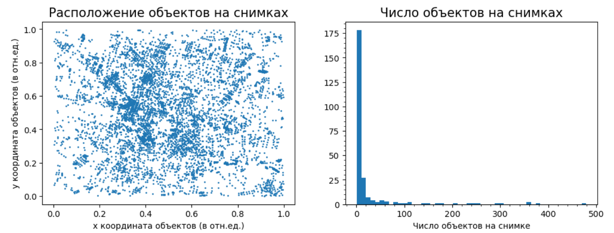
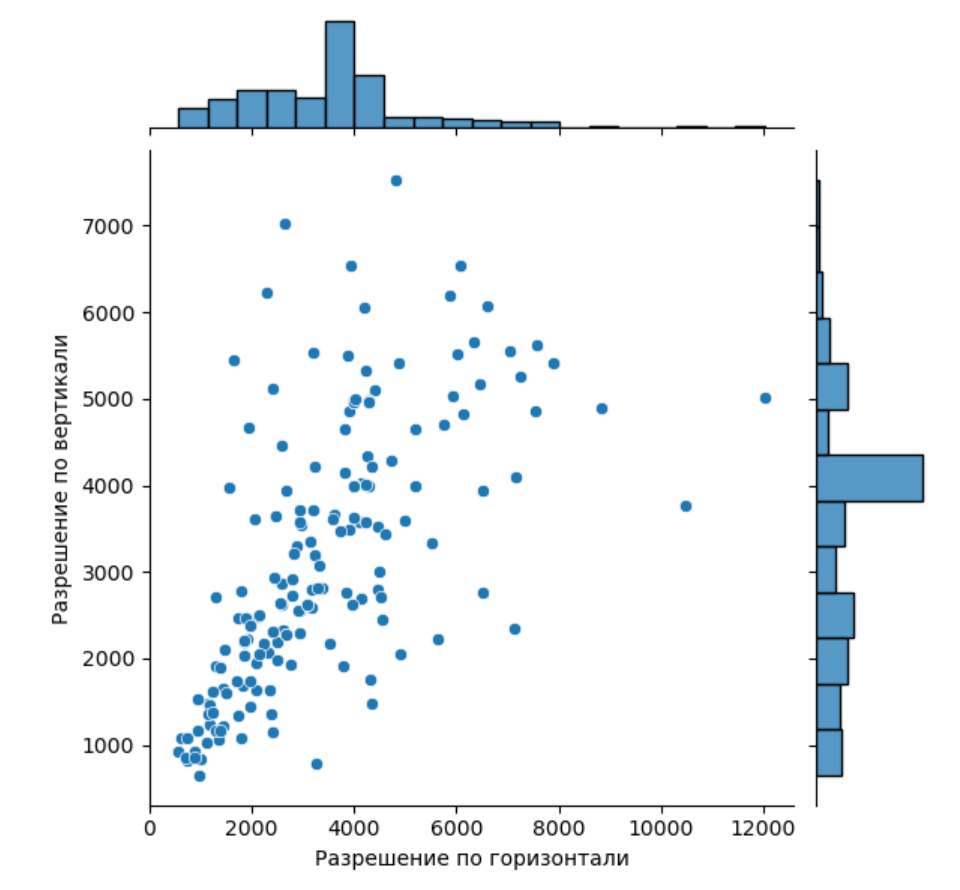
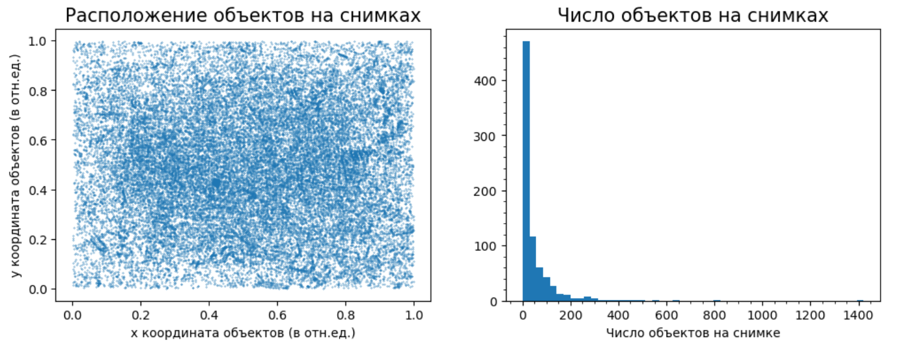
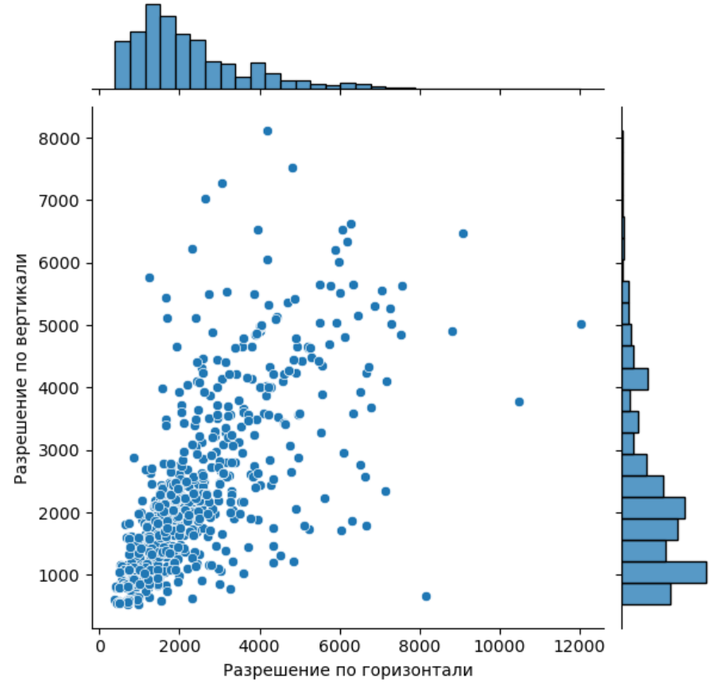
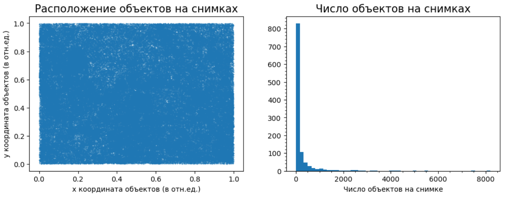
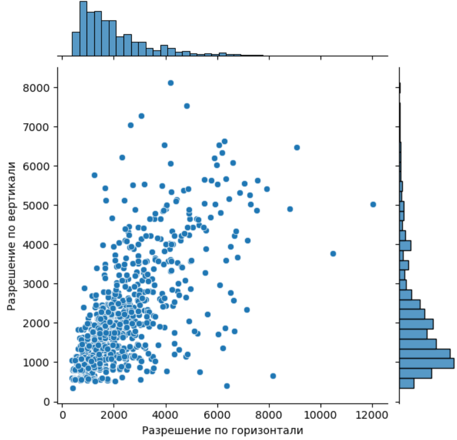
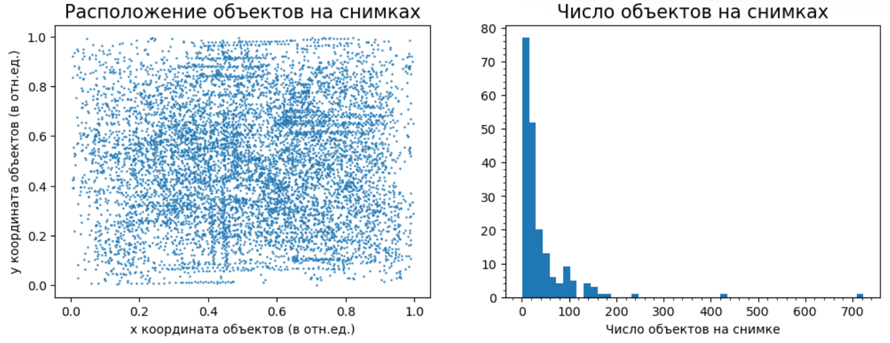
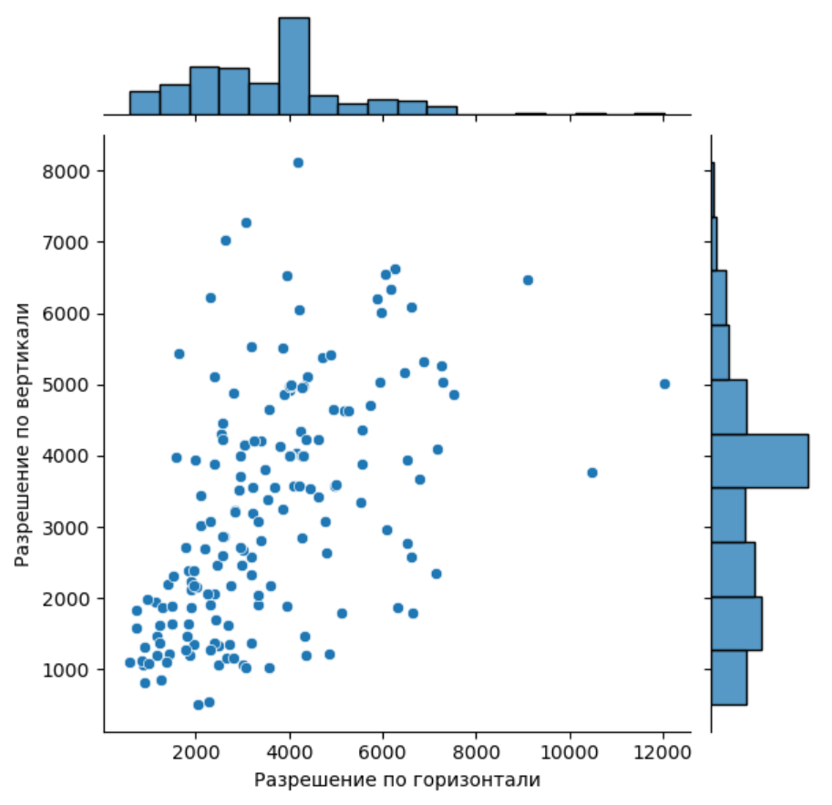

# Разведочный анализ данных
## Общий анализ изображений
Проведём общий анализ изображений. Всего в тренировочной выборке находится 1411 спутниковых снимков. Посмотрим сколько категорий объектов может встречаться на каждом изображении:

На гистаграмме видно, что на снимках встречаются от 1 до 10 категорий объектов. Также посмотрим на разрешение спутниковых снимков:

Тренировочная выборка представлена спутниковыми снимками в разном разрешении, с разным соотношением сторон и разной ориентацией.

## Анализ изображений по категориям
Рассмотрим теперь каждую категорию в отдельности. Маски объектов каждой категории: https://disk.yandex.ru/d/VG-VBLbyK7aOPQ

### Категория 'storage_tank'
С данной категорией есть 245 спутниковых снимков. Рассмотрим расположение обектов и их количество на снимках:

На первом графике точками отмечены центры объектов, координаты берутся относительно ширины и высоты изображений. Размер изображений с объектами данного класса:

### Категория 'Large_Vehicle'
С данной категорией есть 770 спутниковых снимков. Расположение обектов и их количество на снимках:

Размер изображений с объектами данного класса:

### Категория 'Small_Vehicle'
С данной категорией есть 1099 спутниковых снимков. Расположение обектов и их количество на снимках:

Размер изображений с объектами данного класса:

### Категория 'plane'
С данной категорией есть 198 спутниковых снимков. Расположение обектов и их количество на снимках:

Размер изображений с объектами данного класса:

