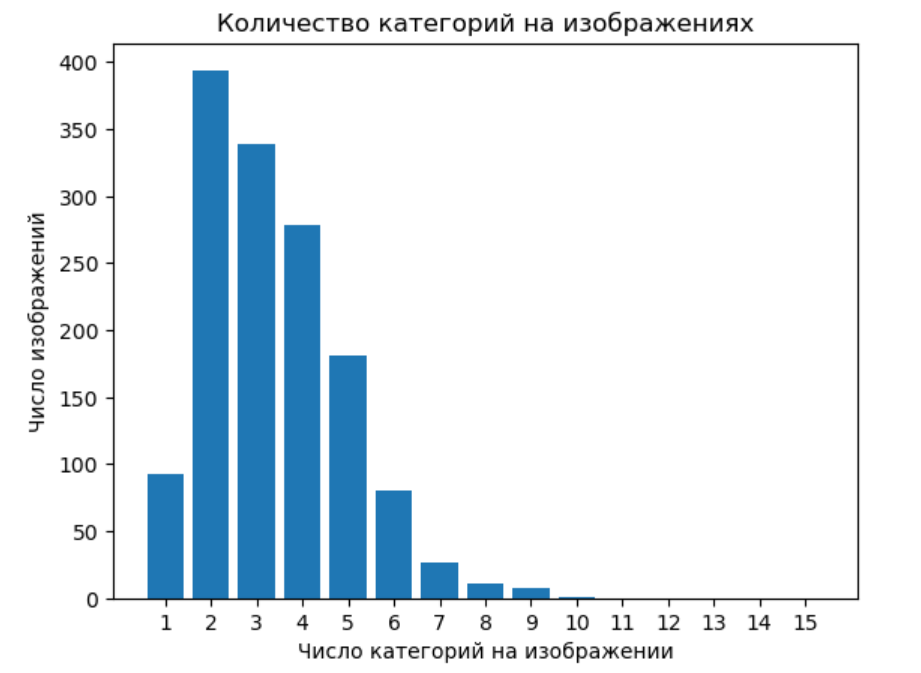
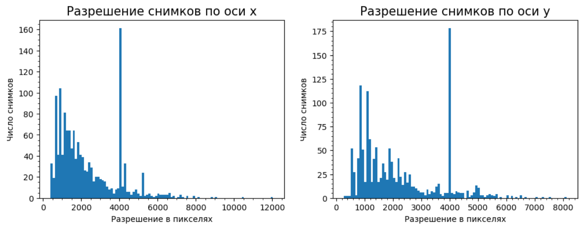

# Разведочный анализ данных
## Общий анализ изображений
Проведём общий анализ изображений. Всего в тренировочной выборке находится 1411 спутниковых снимков. Посмотрим сколько категорий объектов может встречаться на каждом изображении:

На гистаграмме видно, что на снимках встречаются от 1 до 10 категорий объектов. Также посмотрим на разрешение спутниковых снимков:

Тренировочная выборка представлена спутниковыми снимками в разном разрешении, с разным соотношением сторон и разной ориентацией.
## Анализ изображений по категориям
